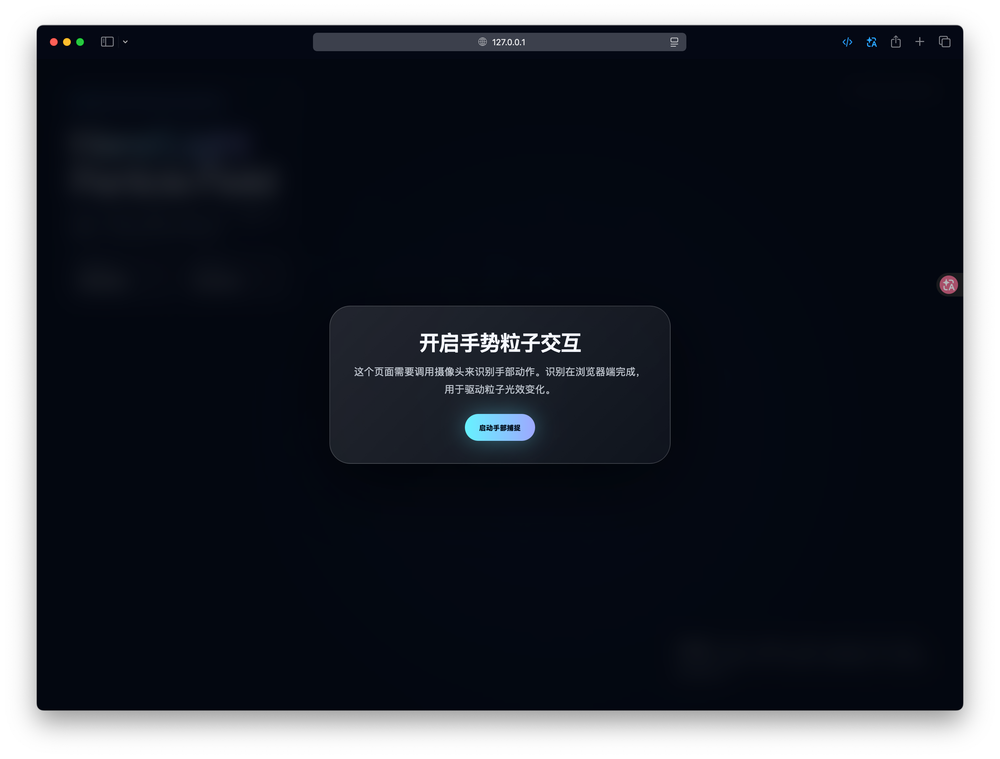

# Hand Light Particle Field

一个基于浏览器摄像头手势识别的粒子光效交互 Demo。页面会通过 MediaPipe Hands 在本地识别手部动作，并把不同手势映射成粒子爆散、核心坍缩、激光扫描、双涡旋等动态效果。

> 识别过程在浏览器端完成，摄像头画面仅用于实时手部追踪。

## 效果预览

<table>
  <tr>
    <td width="50%">
      
      <br />
      <sub>启动页：请求摄像头权限并进入手势捕捉</sub>
    </td>
    <td width="50%">
      
      <br />
      <sub>张开手掌：粒子向外爆散扩张</sub>
    </td>
  </tr>
  <tr>
    <td width="50%">
      
      <br />
      <sub>捏合：粒子向核心坍缩并形成旋涡</sub>
    </td>
    <td width="50%">
      
      <br />
      <sub>双指：左右双涡旋牵引粒子流动</sub>
    </td>
  </tr>
</table>

## 功能亮点

- 实时手势识别：使用 MediaPipe Hands 追踪手部关键点。
- 粒子系统：Canvas 2D 绘制粒子、尾迹、波纹、星尘和光环。
- 多种手势模式：不同手势触发不同粒子运动规则。
- 轻量单页实现：所有核心逻辑都在 `index.html` 中，无需构建工具。
- 响应式界面：桌面端展示摄像头预览和状态面板，移动端自动简化布局。

## 手势映射

| 手势 | 粒子模式 | 效果 |
| --- | --- | --- |
| 未检测到手 | Ambient | 粒子回到星空漂浮状态 |
| 张开手掌 | Burst | 粒子向外爆散，并触发扩散波纹 |
| 握拳 | Collapse | 粒子向掌心收缩，形成星云核心 |
| 单指 | Laser Scan | 粒子靠近扫描光束，生成激光线效果 |
| 双指 | Twin Vortex | 左右两个涡旋中心牵引粒子流 |
| 捏合 | Core Crush | 粒子强力坍缩到核心，并产生高亮爆发 |

## 快速开始

这个 Demo 需要通过 `localhost` 或 HTTPS 运行，浏览器才会允许摄像头权限。不要直接双击打开本地 HTML 文件。

```bash
python3 -m http.server 8000
```

然后在浏览器访问：

```text
http://localhost:8000
```

点击「启动手部捕捉」，允许摄像头权限后即可体验。

## 项目结构

```text
GestureParticleDemo/
├── index.html
├── README.md
└── assets/
    ├── 1.png
    ├── 2.png
    ├── 3.png
    └── 4.png
```

## 技术栈

- HTML / CSS / JavaScript
- Canvas 2D
- MediaPipe Hands
- MediaPipe Camera Utils

## 实现说明

- 手势识别基于 21 个手部关键点，结合指尖、指节和掌宽距离进行简单分类。
- 粒子数量会根据屏幕宽度调整，移动端使用更少粒子来保持流畅。
- 粒子效果包含速度衰减、轨迹尾迹、旋涡牵引、径向波纹和状态切换爆发。
- 依赖通过 CDN 加载，需要网络连接才能首次加载 MediaPipe 脚本。

## 浏览器要求

- 推荐使用 Chrome、Edge 或 Safari 的较新版本。
- 需要可用摄像头。
- 需要在 `localhost` 或 HTTPS 环境下运行。

## 文件说明

- `index.html`：主页面，包含样式、粒子动画、手势识别和交互逻辑。
- `assets/*.png`：README 中使用的效果截图。
